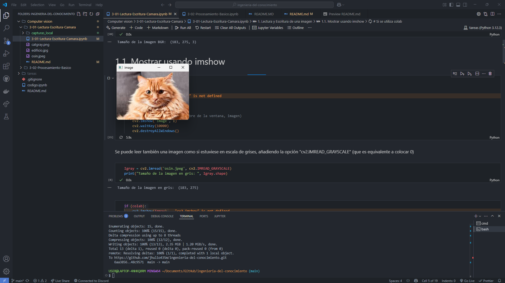
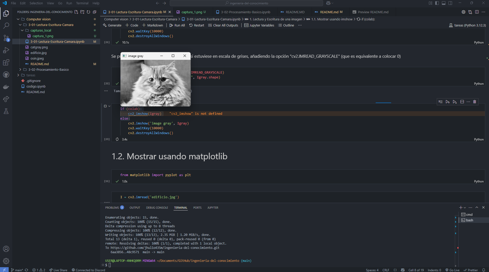

[](https://www.python.org/)
[](https://opencv.org/)
[](https://numpy.org/)

# 🧠 Tarea Práctica: Lectura, Escritura y Captura de Video con OpenCV

<!-- toc -->
## 📌 Índice
- [📘 Contenido de la Tarea](#📘-contenido-de-la-tarea)
- [     1. 📷 Lectura y Visualización de Imagen](#1-lectura-y-visualización-de-imagen)
- [     2. 🎞️ Mostrar Imagen con `cv2.imshow`](#2-mostrar-imagen-con-cv2imshow)
- [     3. 📹 Captura de Video desde Cámara](#3-captura-de-video-desde-cámara)
- [     4. 💾 Grabación de Video desde Cámara](#4-grabación-de-video-desde-cámara)
- [     5. ⚙️ Mejora Interactiva](#5-mejora-interactiva)
- [📦 Dependencias](#📦-dependencias)
- [🗂️ Estructura de la tarea](#🗂️-estructura-del-proyecto)
- [🔍 Referencias](#🔍-referencias)
- [✍️ Autor y Fecha](#✍️-autor-y-fecha)
<!-- tocstop -->

## 📘 Contenido de la Tarea
1. Lectura y visualización de imágenes.  
2. Mostrar imagen usando `cv2.imshow`.  
3. Captura de video desde cámara.  
4. Grabación de video en archivo AVI.  
5. Mejora interactiva: alternar color/escala de grises, pausar, salir y selección de canales RGB.

---

## 1. Lectura y Visualización de Imagen
```python
import cv2
I = cv2.imread('images/osin.jpeg')
print("Tamaño de la imagen BGR:", I.shape)
cv2.imshow('Imagen Original', I)
cv2.waitKey(0)
cv2.destroyAllWindows()
```
### Resultado

```bash
Tamaño de la imagen BGR:  (183, 275, 3)
```

**Captura de Pantalla**


---

## 2. Mostrar Imagen con `cv2.imshow`

```python
Igray = cv2.imread('images/osin.jpeg', cv2.IMREAD_GRAYSCALE)
print("Tamaño de la imagen en gris: ", Igray.shape)
cv2.imshow('image gray', Igray)
cv2.waitKey(5000)
cv2.destroyAllWindows()
```
### Resultado

```bash
Tamaño de la imagen en gris: (183, 275)
```

**Captura de Pantalla**


---

## 3. Captura de Video desde Cámara

```python
cap = cv2.VideoCapture(0)
while True:
    ret, frame = cap.read()
    if not ret:
        break
    cv2.imshow('Video en Color', frame)
    if cv2.waitKey(1) & 0xFF == ord('q'):
        break
cap.release()
cv2.destroyAllWindows()
```

---

## 4. Grabación de Video desde Cámara

```python
cap = cv2.VideoCapture(0)
fourcc = cv2.VideoWriter_fourcc(*'XVID')
out = cv2.VideoWriter('output.avi', fourcc, 20.0, (640, 480))

while True:
    ret, frame = cap.read()
    if not ret:
        break
    out.write(frame)
    cv2.imshow('Grabando Video', frame)
    if cv2.waitKey(1) & 0xFF == ord('q'):
        break

cap.release()
out.release()
cv2.destroyAllWindows()
```

---

## 5. Mejora Interactiva

**Teclas disponibles:**

* `c`: alterna color ↔ gris
* `p`: pausa/reanuda
* `r`, `g`, `b`: muestra solo ese canal
* `q`: salir

```python
import cv2
import numpy as np

cap = cv2.VideoCapture(0)
modo_gris = False
pausa = False
canal = None

while True:
    if not pausa:
        ret, frame = cap.read()
        if not ret:
            break

        if modo_gris:
            disp = cv2.cvtColor(frame, cv2.COLOR_BGR2GRAY)
        elif canal:
            idx = {'b':0,'g':1,'r':2}[canal]
            disp = np.zeros_like(frame)
            disp[:,:,idx] = frame[:,:,idx]
        else:
            disp = frame

        cv2.imshow('Captura Interactiva', disp)

    key = cv2.waitKey(30) & 0xFF
    if key == ord('c'):
        modo_gris = not modo_gris
        canal = None
    elif key == ord('p'):
        pausa = not pausa
    elif key == ord('q'):
        break
    elif key in map(ord, ['r','g','b']):
        letra = chr(key)
        canal = None if canal == letra else letra
        modo_gris = False

cap.release()
cv2.destroyAllWindows()
```

---

## 📦 Dependencias

* Python 3.x
* OpenCV (`pip install opencv-contrib-python`)
* NumPy (`pip install numpy`)

---

## 🗂️ Estructura de la tarea

```
3-01-Lectura-Escritura-Camara/
├── images/
│   └── catgray.png
│   └── edificio.jpg
│   └── osin.jpeg
├── screenshots/
│   ├── captura_1.png
│   └── captura_2.png
├── 3-01-Lectura-Escritura-Camara.ipynb
└── README.md
```

---

## 🔍 Referencias

* Ingeniería del Conocimiento UNCP 2025: [https://github.com/Jaime1406/Ingenieria\_del\_conocimiento\_UNCP\_2025/](https://github.com/Jaime1406/Ingenieria_del_conocimiento_UNCP_2025/)
* CS231n: Deep Learning for Computer Vision: [https://cs231n.stanford.edu/](https://cs231n.stanford.edu/)

---

## ✍️ Autor y Fecha

* 👤 **Jhulio Alessandro Morán de la Cruz**
* 🧑‍💻 [@jhulio435m](https://github.com/jhulio435m)
* 📅 **Fecha**: 15 de mayo de 2025