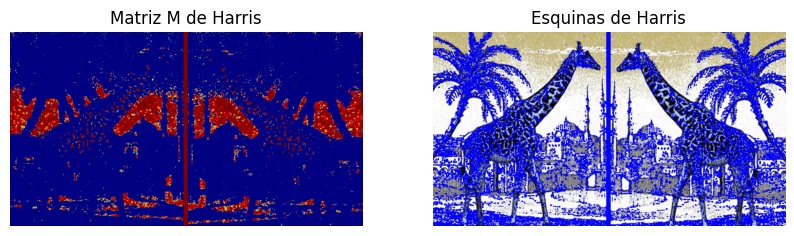
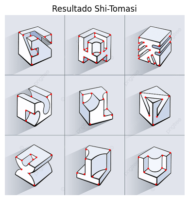
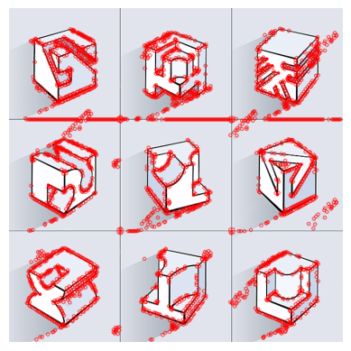
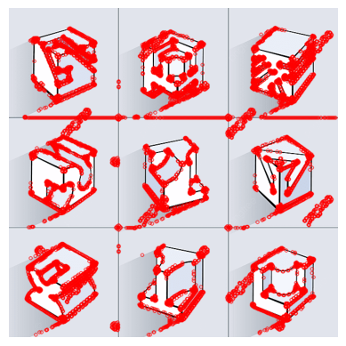

[](https://www.python.org/)  [](https://opencv.org/)  [](https://numpy.org/)  [](https://matplotlib.org/)

# 🧠 Tema: Tarea Práctica: Detectores y Descriptores de Características con OpenCV

<!-- toc -->
## 📌 Índice
- [🧾 Descripción General](#descripción-general)  
- [📘 Contenido de la Tarea](#contenido-de-la-tarea)  
- [1. 🔍 Lectura y Preprocesamiento de Imágenes](#1-lectura-y-preprocesamiento-de-imágenes)  
- [2. 📍 Detección de Puntos Clave](#2-detección-de-puntos-clave)  
- [3. 🎨 Cálculo de Descriptores](#3-cálculo-de-descriptores)  
- [4. 🔗 Coincidencia de Descriptores](#4-coincidencia-de-descriptores)  
- [5. 🖼️ Visualización de Resultados](#5-visualización-de-resultados)  
- [6. 🤔 Comparación de Métodos](#6-comparación-de-métodos)  
- [📦 Dependencias](#dependencias)  
- [🗂️ Estructura del Proyecto](#estructura-del-proyecto)  
- [🔍 Referencias](#referencias)  
- [✍️ Autor y Fecha](#autor-y-fecha)  
<!-- tocstop -->

## 🧾 Descripción General
En esta práctica exploraremos distintos detectores (SIFT, ORB, AKAZE…) y descriptores de características en OpenCV. Aprenderás a:
- Cargar y preprocesar imágenes.  
- Detectar puntos clave en una escena.  
- Extraer descriptores para cada punto.  
- Emparejar características entre dos imágenes.  
- Visualizar y comparar resultados de diferentes algoritmos.

## 📘 Contenido de la Tarea
1. Lectura y preprocesamiento de imágenes  
2. Detección de puntos clave  
3. Cálculo de descriptores  
4. Coincidencia de descriptores  
5. Visualización de resultados  
6. Comparación de métodos  

---

## 1. Detectores

### 1.1. Detector de esquinas ("corners") de Harris

```python
nsize = 2    # Tamaño del vecindario (neighborhood)
ksize = 3    # Tamaño del Kernel (para el filtro de Sobel)
k = 0.06     # Valor de k en Harris

# Detector de Harris
Iharris = cv2.cornerHarris(Igray, nsize, ksize, k)
````

```python
# Dilatar el resultado solo para observar mejor las esquinas (corners)
Iharris_dil = cv2.dilate(Iharris, None)
# Cambiar el mapa de color solo para mostrar
Iharrish = cv2.applyColorMap(cv2.convertScaleAbs(Iharris_dil), cv2.COLORMAP_JET)

# Mostrar las esquinas (corners) si son mayores a th*max (como rojo)
th = 0.01
I[Iharris_dil > th*Iharris_dil.max()] = [0, 0, 255]

plt.figure(figsize=(10,10))
plt.subplot(121)
plt.imshow(Iharrish, cmap='gray'); plt.title('Matriz M de Harris'); plt.axis('off')
plt.subplot(122)
plt.imshow(I, cmap='gray'); plt.title('Esquinas de Harris'); plt.axis('off')
plt.show()
```
### Resultado

**Captura de Pantalla**



---

#### 1.2. Detector de Shi-Tomasi

```python
I = cv2.imread('./images/blocks.png')

Igray = cv2.cvtColor(I, cv2.COLOR_BGR2GRAY)
Igray = np.float32(Igray)
```
```python
numcorners = 100  # Mejores esquinas a mantener
quality = 0.01   # Debajo de este valor se rechaza
mindist = 10     # Mínima distancia euclideana entre esquinas

# Detector (llamado en OpenCV good features to track)
Icorners = cv2.goodFeaturesToTrack(Igray, numcorners, quality, mindist)
Icorners = np.intp(Icorners)
```
```python
for i in Icorners:
    x,y = i.ravel()
    cv2.circle(I, (x,y), 3, 255, -1)

plt.imshow(I, cmap='gray')
plt.title('Resultado Shi-Tomasi')
plt.axis('off'); plt.show()
```
### Resultado

**Captura de Pantalla**



---

### 1.3. Detector FAST

```python
Igray = cv2.cvtColor(I, cv2.COLOR_BGR2GRAY)

# Iniciar del detector FAST con valores por defecto
fast = cv2.FastFeatureDetector_create()

# "Keypoints" usando FAST
keypts = fast.detect(Igray, None)
```

```python
# Dibujar y mostrar los keypoints en la imagen
Ifast = I.copy()
cv2.drawKeypoints(I, keypts, Ifast, color=(255,0,0))

plt.imshow(Ifast)
plt.axis('off'); plt.show()
```

```python
# Mostrar los parámetros por defecto
print("Threshold: ", fast.getThreshold())
print("nonmaxSuppression: ", fast.getNonmaxSuppression())
print("neighborhood: ", fast.getType())
print("Keypoints con supresión de no máximos: ", len(keypts))
```

### Resultado
```bash
# Mostrar los parámetros por defecto
print("Threshold: ", fast.getThreshold())
print("nonmaxSuppression: ", fast.getNonmaxSuppression())
print("neighborhood: ", fast.getType())
print("Keypoints con supresión de no máximos: ", len(keypts))
```

**Captura de Pantalla**



### Detección sin supresión de no máximos (non-max suppression)**

```python
# Quitar la supresión de no máximos
fast.setNonmaxSuppression(0)
# Realizar la detección
keypts2 = fast.detect(Igray, None)
```

```python
print("Keypoints sin supresión de no máximos: ", len(keypts2))

Ifast2 = I.copy()
cv2.drawKeypoints(I, keypts2, Ifast2, color=(255,0,0))

plt.imshow(Ifast2)
plt.axis('off'); plt.show()
```

### Resultado
```bash
print("Keypoints sin supresión de no máximos: ", len(keypts2))

Ifast2 = I.copy()
cv2.drawKeypoints(I, keypts2, Ifast2, color=(255,0,0))

plt.imshow(Ifast2)
plt.axis('off'); plt.show()
```
**Captura de Pantalla**


---

## 4. 🔗 Coincidencia de Descriptores

```python
bf = cv2.BFMatcher(cv2.NORM_L2, crossCheck=False)

# Matches SIFT <-> SIFT
matches = bf.knnMatch(des1_sift, des2_sift, k=2)
# Ratio test de Lowe
good = [m for m,n in matches if m.distance < 0.75*n.distance]
```
### Resultado
```bash

```
**Captura de Pantalla**
---

## 5. 🖼️ Visualización de Resultados

```python
img_matches = cv2.drawMatchesKnn(
    img1, kp1_sift, img2, kp2_sift,
    [good], None,
    flags=cv2.DrawMatchesFlags_NOT_DRAW_SINGLE_POINTS
)
plt.figure(figsize=(12,6))
plt.imshow(img_matches); plt.title('SIFT Matches'); plt.axis('off')
plt.show()
```
### Resultado
```bash

```
**Captura de Pantalla**


---

## 6. 🤔 Comparación de Métodos

* **Cuenta de keypoints**: SIFT vs ORB vs AKAZE
* **Tiempo de detección y descript.**
* **Cantidad de matches buenos**
* **Calidad visual de emparejamientos**

### Resultado
```bash

```
**Captura de Pantalla**


---

## 📦 Dependencias

* Python 3.7+
* OpenCV (`pip install opencv-contrib-python`)
* NumPy (`pip install numpy`)
* Matplotlib (`pip install matplotlib`)

---

## 🗂️ Estructura del Proyecto

```
detectores-descriptores-opencv/
├── images/                       
├── screenshots/    
├── 3-04-Detectores-Descriptores.ipynb            
└── README.md               
```

---

## 🔍 Referencias

* Ingeniería del Conocimiento UNCP 2025: [https://github.com/Jaime1406/Ingenieria\_del\_conocimiento\_UNCP\_2025/](https://github.com/Jaime1406/Ingenieria_del_conocimiento_UNCP_2025/)
* CS231n: Deep Learning for Computer Vision: [https://cs231n.stanford.edu/](https://cs231n.stanford.edu/)

---

## ✍️ Autor y Fecha

* **Autor:** Jhulio Alessandro Morán de La Cruz
* **Github:** [@jhulio435m](https://github.com/jhulio435m)
* **Fecha**: 16 de mayo de 2025
